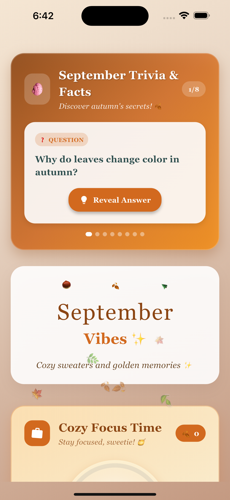
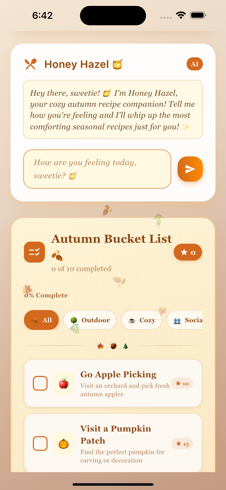
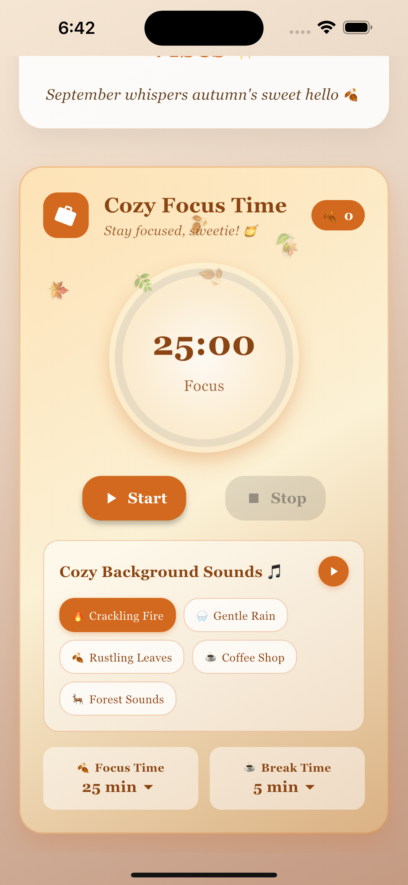
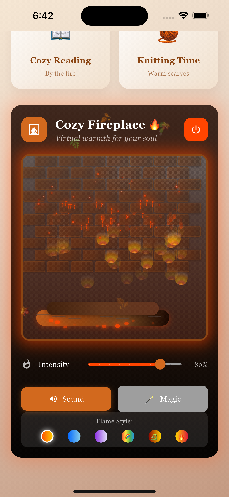

# 🔥 Fireside September 🔥

Welcome to **Fireside September**, a cozy and cute application designed to bring the warmth and comfort of autumn right to your screen. This app was created as a special project for the **Codecademy September Monthly Challenge**, with a little help from my AI pair programmer, **GitHub Copilot**.


## 📸 Screenshots

> A peek into the cozy corners of Fireside September.

<div align="center">

### September Trivia & Facts


### Honey Hazel & Autumn Bucket List


### Cozy Focus Time (Pomodoro)


### Cozy Fireplace


</div>

## 🍂 About the App

As the leaves turn to gold and the air gets a little crisper, *Fireside September* offers a digital sanctuary to relax, focus, and embrace the autumn vibes. Whether you want to study by a crackling fireplace, unwind to the sound of gentle rain, or simply enjoy a moment of peace, this app is your perfect companion.

## ✨ Features

*   **Fireplace Simulator**: A virtual fireplace that brings a warm, ambient glow to your screen.
*   **Mood Chat**: A friendly chat interface to interact with a cheerful AI.
*   **Pomodoro Timer**: A productivity tool to help you stay focused and take mindful breaks.
*   **Parallax Background**: A beautiful, layered background that creates a sense of depth and immersion.
*   **September Trivia**: Fun and interesting facts about the month of September.
*   **Ambient Sounds**: Relaxing audio loops of a crackling fire and gentle rain.

## 🛠️ Tech Stack

This project was built with a modern and robust tech stack, ensuring a smooth and delightful user experience across multiple platforms.

*   **Framework**: [Flutter](https://flutter.dev/)
*   **Language**: [Dart](https://dart.dev/)
*   **AI Integration**: [Google Generative AI](https://pub.dev/packages/google_generative_ai)
*   **Audio**: [audioplayers](https://pub.dev/packages/audioplayers)
*   **App Icons**: [flutter_launcher_icons](https://pub.dev/packages/flutter_launcher_icons)

## 🚀 Getting Started

To run this project locally, follow these steps:

1.  **Clone the repository:**
    ```sh
    git clone https://github.com/adr1el-m/codedex-SeptemberChallenge.git
    ```
2.  **Navigate to the project directory:**
    ```sh
    cd fireside_september
    ```
3.  **Install dependencies:**
    ```sh
    flutter pub get
    ```
4.  **Run the app:**
    ```sh
    flutter run
    ```

## 🤖 A Note on AI-Assisted Development

This project was developed in collaboration with **GitHub Copilot**, which served as an AI pair programmer. From generating boilerplate code to suggesting creative ideas and debugging, GitHub Copilot was an invaluable tool in bringing *Fireside September* to life. This project is a testament to the power of human-AI collaboration in modern software development.

---

Thank you for visiting, and I hope you enjoy the cozy atmosphere of *Fireside September*!
